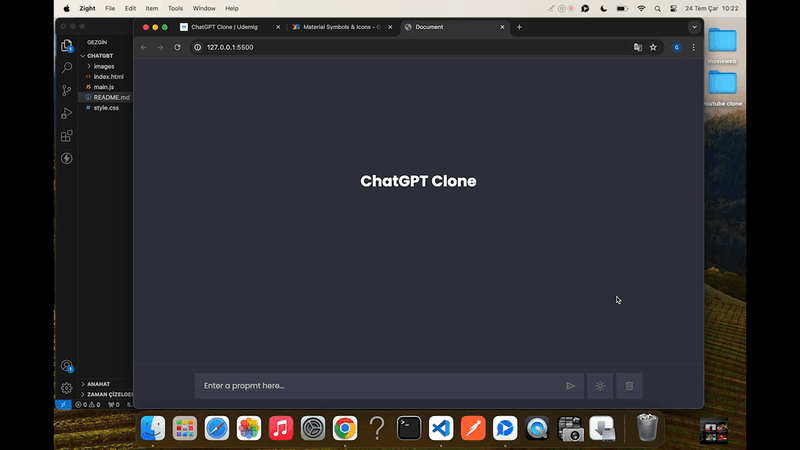

##ChatGPT-Clone 

- HTML, CSS ve JAVASCRİPT Kullanılarak tasarlanmıştır.

- API çağrıları ve verileri çekmek için rapidapi kütüphanesi kullanılmıştır.

- 

<!--ChatGPT:https://rapidapi.com/rphrp1985/api/chatgpt-42/playground/apiendpoint_4945d7ba-fd20-47de-ac8b-1c137f52ae52
API'ye istek atabilmemiz için inputun içerisinde ki değeri almamız gerekir.

Bu değeri alırken send butonuna tıkladığımızda alacağız.

Inputun içerisindeki değeri kullanıcı profilinin yanına eklememiz gerekir.

Bunu gerçekleştirirken yeniden kullanabileceğimiz bir createElement fonksiyonu oluşturduk ve buna iki parametre gönderdik.Birinci parametre chat-containera eklemek istediğimiz html yapısıdır.İkinci parametre ise eklemek istediğimiz htmlin class ismidir.

Kullanıcı veriyi girdikten sonra animasyonu showTypingAnimation fonksiyonunu kullanarak ekrana bastık.Sonrasında da kullanıcının girdiği veriye göre getChatResponse fonksiyonu ile API'ye istek attık.

İstek atarken asenkron işlem olduğu için async await ile bekledik.

getChatResponse fonksiyonunu parametre olarak incomingChatDiv'i gönderdik.Çünkü veritabanından gelen veriyi incomingChatDiv'in içerisinde bulunan typinganimation yerine aktaracağız. -->